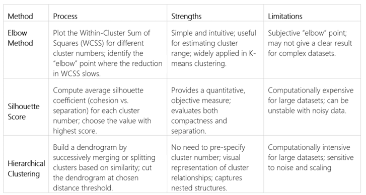
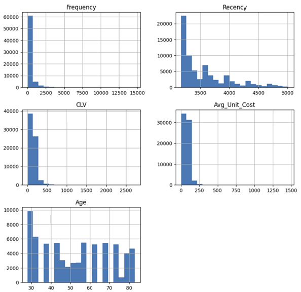
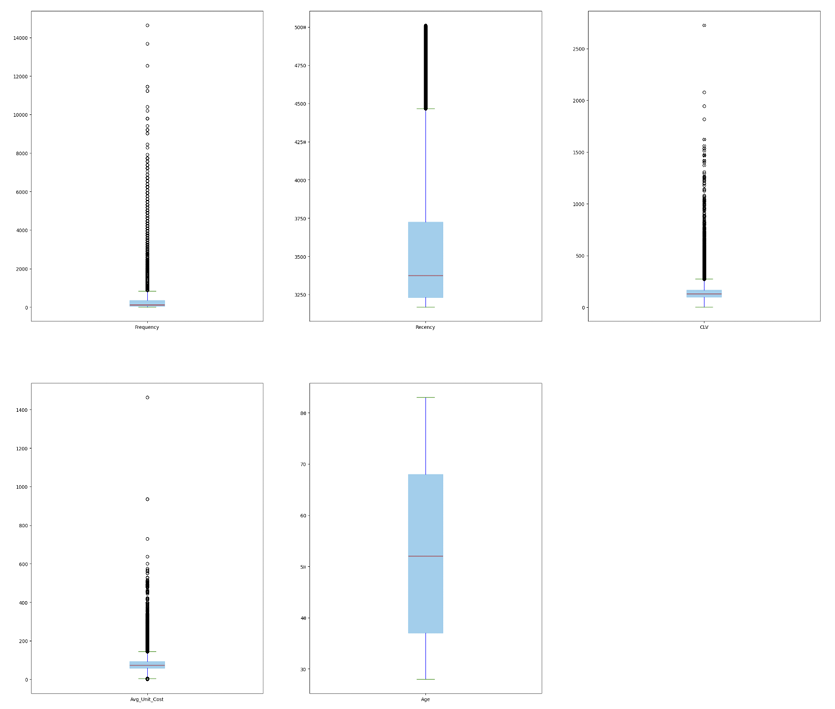
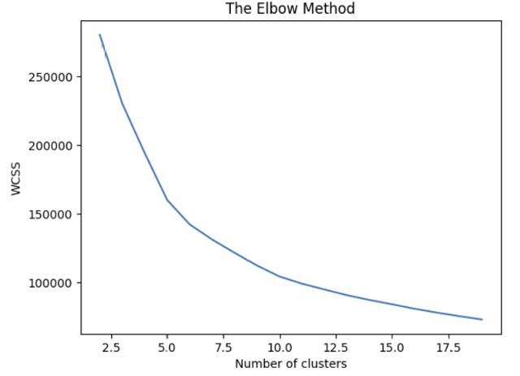
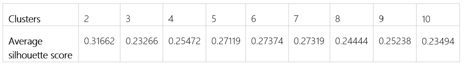
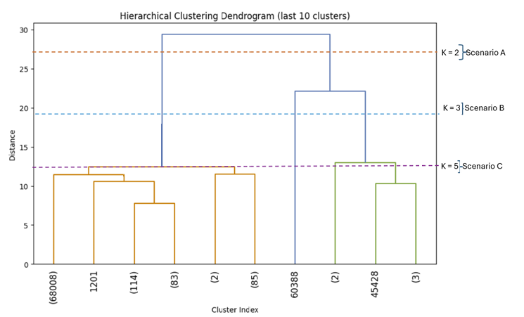
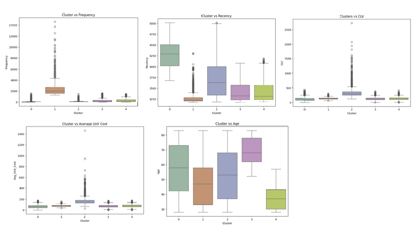
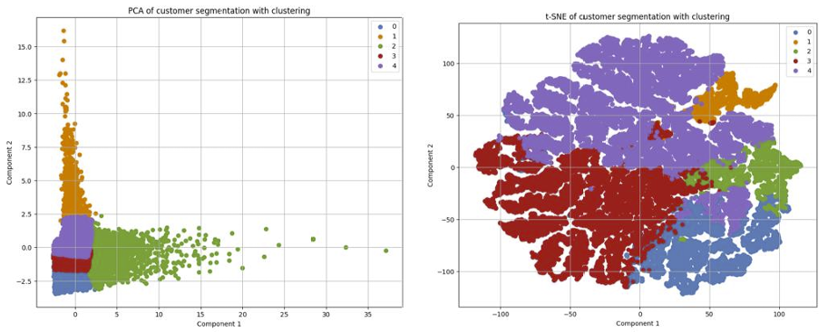

#  Customer segmentation with clustering 

## 1. Introduction  
In today’s highly competitive e-commerce landscape, understanding customers 
and tailoring strategies to their needs is essential for sustaining growth and 
improving marketing effectiveness. Customer segmentation provides a 
systematic approach to group customers based on their characteristics and 
purchasing behaviours, enabling organizations to deliver personalized offers, 
optimize resource allocation, and strengthen customer relationships. 
This project focuses on developing a robust customer segmentation model using 
a real-world e-commerce dataset. The study aims to leverage data exploration, 
preprocessing, feature engineering, and dimensionality reduction techniques to 
develop effective clustering models for customer segmentation. By uncovering 
meaningful customer groups, the e-commerce company can adopt a more 
customer-centric approach, leading to improved marketing efficiency, higher 
customer satisfaction, and ultimately, increased profitability. 

## 2. Methods 
The dataset is transnational, spanning five continents (Oceania, North America, 
Europe, Africa, and Asia) and consists of 951,668 transaction records collected 
between 1 January 2012 and 30 December 2016.Table: Cluster Validation and Selection Methods. 

## 2.1 The Elbow Method  
The Elbow method was applied, which plots the WCSS against a range (2 -20) of potential k values. This range was chosen since extending it further did not affect the plot but increased computation time.  

## 2.2 Silhouette Score Method 
Silhouette score measures how similar an object is to its own cluster compared to other clusters. The method was applied for k in the range (2 to 20). 

## 2.3. Hierarchical Clustering 
The aggregate scale was used for the hierarchical clustering dendrogram. The number of clusters was limited to p =10 due to computational limitations.

## 3. RESULTS
## 3.1 Histogram observation 
Frequency: right-skewed distribution, most customers have very low purchase frequencies, clustered near 0–500. Recency: Distribution is right-skewed, most customers have low recency values (3000–3500). CLV: Strong right skew, 
concentrated between (0–500). Avg_Unit_Cost: Heavily concentrated at 0–200, and most customers buy low-cost items. Age: Distribution is more uniform and peaks around ages 28–30, Figure. 

## 3.2 Boxplots  
The boxplots in Figure 2 reveal that most customer behaviours (frequency, CLV, and Av_Unit_cost) are concentrated at the lower end with many extremely highvalue positive outliers, while recency shows moderate variability, and age is the most evenly distributed with minimal outliers.

## 3.3 The Elbow Method
The Elbow Method was applied, which plots the WCSS against a range of potential k values. The WCSS decreases rapidly from k=1 to approximately k=4 
and reveals a clear bend at around k=5 to k=6. 

## 3.4. Silhouette Score Method 
The Silhouette score peaks at k=2 but shows a peak around k=4 to k=7. Beyond k=7, the score declines, Table: Silhouette score 

## 3.5. Hierarchical Clustering 
The hierarchical clustering dendrogram shows several potential cut points Figure
 1. Scenario A: Clear split into two groups, long vertical line at the top, connecting two large branches, k=2.
2. Scenario B: Clear split into 3 groups, the line connects clusters within one 
and two main branches, k=3. 
3. Scenario C: Clear split into 5 Groups. The vertical line is mixed with 
shorter and longer, k=5.

## 3.6. Cluster selection 
All three methods converge unequivocally on the same result. The evidence from computational efficiency (Elbow), cluster quality (Silhouette), and natural data structure (Dendrogram) is consistent; thus, the optimal number of clusters that best represents the data is k = 5. 

## 3.6.1 Cluster boxplot 
Figure shows the clusters vs (frequency, recency, CLV, average unit cost, and customer age) 
-  The plot (Cluster vs Frequency) shows that customer frequency is extremely 
uneven. Cluster 1: represents the most frequent group, heavy buyers, 
clusters (0, 2) intermediate, purchase infrequently, clusters (3, 4): the least 
frequent purchase group. All outliers are in the positive direction. 
- The plot (Cluster vs Recency) shows a clear separation of customer groups 
by recency, from very low recent buyers Cluster 1 to long-inactive 
customers Clusters (0, 2, 3, 4), highlighting where engagement and 
reactivation strategies should be focused. 
- The CLV plot shows that Cluster 2 contains the most valuable customers 
(with extreme outliers driving revenue), while Clusters (0, 1) represent mid
value customers, and Clusters (3, 4) contain low-value buyers. 
- The Average Unit Cost plot shows that Cluster 2 represents high-value 
customers, while Clusters (1, 3, 4) represent middle-market customers with 
moderate spending preferences, and Cluster 0 clearly identifies price
sensitive customers. 
- The boxplot shows distinct age distributions across clusters. Cluster 4 is the 
youngest group (median 37 years). Clusters (1, 2) represent middle-aged 
to older adults (medians 47 and 53 years). Cluster (0, 3) is the oldest group 
(median 59 and 68 years), concentrated around 60–80 years. 

## 3.6.2 PCA and t-SME 
The PCA and t-SNE successfully reduce dimensionality while preserving cluster 
structure. Figure PCA, t-SNE of customer segmentation with clustering demonstrates effective customer segmentation with clearly defined groups that represent distinct behavioral patterns. 

## 4. Conclusion 
Three methods Elbow Method, Hierarchical Dendrogram, and Silhouette Score, 
were applied to determine the optimal number of clusters. The Elbow Method 
revealed a clear bend at around k=5 to k=6. Similarly, the Hierarchical Clustering 
Dendrogram shows that a cut at k=5 offers a balanced solution. The Silhouette 
Score provided additional validation. While the highest score appeared at k=2 
(0.317), this would group customers too broadly for actionable insights. Scores 
for k=5 (0.271) and k=6 (0.274) demonstrated more meaningful separation, 
balancing interpretability and cluster quality.  
K-Means clustering was applied to partition customers into five distinct groups. 
PCA and t-SNE were employed for a more intuitive visualization of cluster 
separability, confirming the robustness of the chosen segmentation method. 
This enables the business to identify distinct customer groups, such as loyal high
value buyers, occasional purchasers, and price-sensitive customers. With this level 
of segmentation, the company can design personalized offers, loyalty programs, 
and targeted campaigns to maximize customer value and long-term growth.

